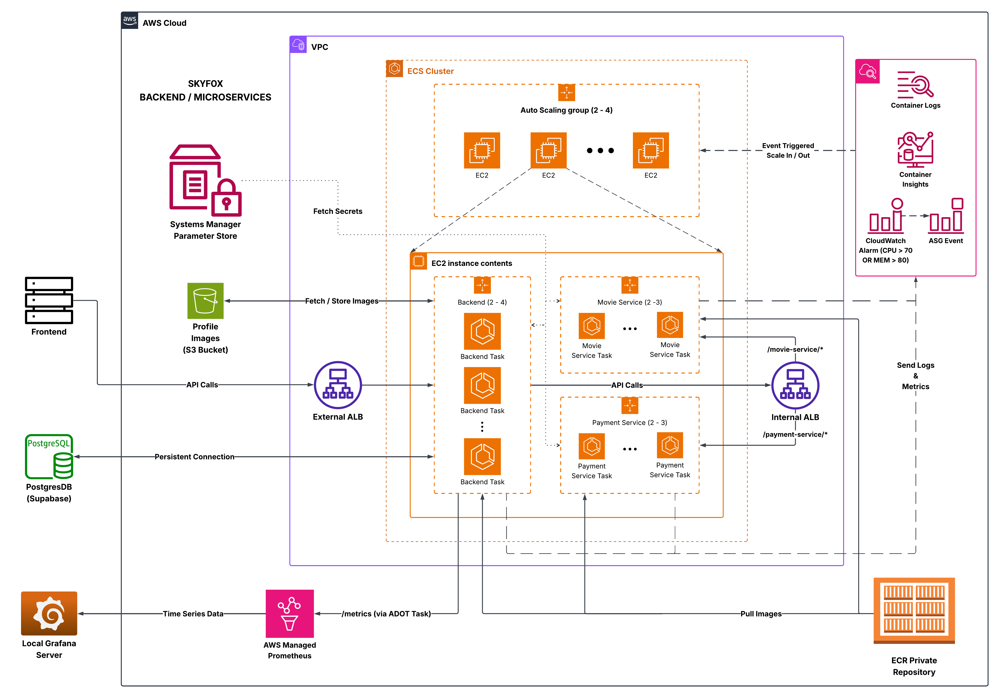

# SkyFox DevOps Infrastructure

**Production-grade microservices platform on AWS using Terraform and ECS with enterprise monitoring and observability.**

## Overview

SkyFox is a movie platform backend with three core services deployed on AWS ECS:
- **Backend Service** (8080): Main API with authentication and Supabase integration  
- **Payment Service** (8082): Transaction processing
- **Movie Service** (4567): Movie catalog management

## Architecture


**Key Design Decisions:**
- **Public subnet deployment**: All services with internet access for operational simplicity
- **Path-based routing**: Internal ALB routes requests based on `/payment-service/*` and `/movie-service/*` patterns
- **Bridge networking**: ECS tasks use bridge mode for optimal resource utilization and sidecar monitoring

## Cloud-Native Security Posture

- **Zero Secret Sprawl:** Absolutely no application credentials or secrets are ever baked into container images, source code, or filesystems.
- **Centralized Secret Management:** All sensitive values (database URLs, API keys, credentials) are securely stored in AWS SSM Parameter Store as encrypted `SecureString` parameters.
- **Runtime Secret Injection:** At container launch, ECS fetches environment variables securely from SSM—no plaintext files, ever.
- **Least Privilege IAM:** Service roles follow the principle of least privilege for accessing SSM and AWS APIs.
- **Public-Facing, But Hardened:** Even though services run in public subnets, only whitelisted ports/protocols are exposed. Sensitive endpoints are protected both by the ALB and the application itself.
- **Bot-Proof by Design:** All endpoints are protected by robust API key authentication. Frequent, automated internet scans for cloud keys, ENV files, or secrets are blocked and always receive 403 Forbidden.
- **Defense-in-Depth:** Security groups, IAM roles, and ECS task permissions together create robust, layered defenses for all workloads.
- **Thorough Logging for Audit:** All the activity is recorded and stored in `Cloudwatch` with specific streams for `container level`, `service level` and `task level` logs with `CloudWatch Alarms` setup for suspicious activity!

> **Summary:**  
> SkyFox DevOps is designed for cloud security from day one. Even if exposed to the public internet, application secrets are impossible to leak through classic endpoint scanning or image forensics.

## Infrastructure Components

### Network Architecture
- **VPC**: `10.0.0.0/16` spanning 3 availability zones
- **Public subnets only**: Simplified networking with security group-based isolation
- **Security groups**: Three-layer approach (External ALB, Internal ALB, ECS Instances)

### Container Platform
- **ECS Cluster**: 2-4 t4g.small ARM64 instances with auto-scaling
- **Service distribution**: Efficient placement across available instances
- **Bridge networking**: Container-to-container communication within tasks

### Load Balancing & Service Discovery
- **External ALB**: Internet-facing for frontend traffic
- **Internal ALB**: Service mesh alternative with path-based routing
- **Health monitoring**: Custom endpoints (`/health`, `/pshealth`, `/mshealth`)

### Monitoring & Observability
- **AWS Managed Prometheus (AMP)**: Centralized metrics storage
- **ADOT Sidecar Pattern**: Per-task metrics collection and forwarding
- **Container links resolution**: Enables `backend:8080` hostname resolution in bridge mode
- **Unique deployment tracking**: Instance labeling with deployment IDs

## Repository Structure

```
terraform/
├── main.tf                    # Module orchestration
├── outputs.tf                 # Infrastructure URLs and configurations
├── variables.tf               # Global settings and customization
└── modules/
    ├── networking/            # VPC, subnets, security groups
    ├── ecr/                   # Docker repositories with lifecycle policies
    ├── ecs/                   # Container platform and services
    │   ├── asg.tf             # Auto Scaling Group configuration
    │   ├── services.tf        # ECS service definitions
    │   ├── tasks.tf           # Task definitions with sidecar monitoring
    │   └── adot-config.tf     # ADOT monitoring configuration
    ├── alb/                   # Application Load Balancers
    ├── s3/                    # Profile image storage
    └── prometheus/            # AWS Managed Prometheus workspace
```

## Quick Start

### Prerequisites
- AWS CLI configured with appropriate permissions
- Terraform >= 1.0
- Docker for container image building

### 1. Backend State Configuration
```bash
# Create S3 bucket for Terraform state
aws s3api create-bucket \
  --bucket skyfox-terraform-state-${RANDOM_SUFFIX} \
  --create-bucket-configuration LocationConstraint=ap-south-1

# Enable versioning
aws s3api put-bucket-versioning \
  --bucket skyfox-terraform-state-${RANDOM_SUFFIX} \
  --versioning-configuration Status=Enabled

# Create DynamoDB table for state locking
aws dynamodb create-table \
  --table-name skyfox-terraform-locks \
  --attribute-definitions AttributeName=LockID,AttributeType=S \
  --key-schema AttributeName=LockID,KeyType=HASH \
  --billing-mode PAY_PER_REQUEST
```

### 2. Environment Configuration
```bash
# Store application secrets in Parameter Store
aws ssm put-parameter --name "/skyfox-backend/jwt-secret" --value "your-jwt-secret" --type "SecureString"
aws ssm put-parameter --name "/skyfox-backend/database-url" --value "your-supabase-url" --type "SecureString"
aws ssm put-parameter --name "/skyfox-backend/movie-service-api-key" --value "your-key" --type "SecureString"
aws ssm put-parameter --name "/skyfox-backend/payment-gateway-api-key" --value "your-key" --type "SecureString"
aws ssm put-parameter --name "/skyfox-backend/s3-bucket" --value "bucket-name" --type "SecureString"
aws ssm put-parameter --name "/skyfox-backend/api-gateway-key" --value "your-api-gateway-key" --type "SecureString"
```

### 3. Deployment Strategy

**Phase 1: Infrastructure Foundation**
```bash
cd terraform
terraform init
terraform plan
terraform apply  # Deploys VPC, ALB, ECR, S3, AMP
```

**Phase 2: Container Images**
```bash
# ECR authentication
aws ecr get-login-password --region ap-south-1 | \
  docker login --username AWS --password-stdin ${ACCOUNT_ID}.dkr.ecr.ap-south-1.amazonaws.com

# Build and push ARM64 images
docker buildx build --platform linux/arm64 \
  --tag ${ACCOUNT_ID}.dkr.ecr.ap-south-1.amazonaws.com/skyfox-devprod-backend:latest \
  --push .
```

**Phase 3: Service Deployment**
```bash
# Deploy services with auto-scaling
terraform apply -var="deploy_services=true" -var="enable_auto_scaling=true"
```

## Advanced Deployment Options

### Per-Service Version Control
```bash
# Deploy specific service versions
terraform apply \
  -var="deploy_services=true" \
  -var="enable_auto_scaling=true" \
  -var="backend_image_tag=v2.1.0" \
  -var="payment_image_tag=v1.5.2" \
  -var="movie_image_tag=v1.3.1"

# Force service restart
terraform apply \
  -var="deploy_services=true" \
  -var="force_backend_deployment=true"
```

### Available Deployment Variables
| Variable | Description | Example |
|----------|-------------|---------|
| `deploy_services` | Enable ECS service deployment | `true/false` |
| `enable_auto_scaling` | Enable auto-scaling policies | `true/false` |
| `backend_image_tag` | Backend service image version | `v2.1.0` |
| `payment_image_tag` | Payment service image version | `v1.5.2` |
| `movie_image_tag` | Movie service image version | `v1.3.1` |
| `adot_image_tag` | ADOT Collector image version | `v1.0.2` |
| `force_*_deployment` | Force service restart (adot requires backend service restart) | `true/false` |

## Monitoring Architecture

### ADOT Sidecar Implementation

**Container Task Structure:**
```yaml
ECS Task:
  - Backend Container (port 8080)
    ├── Exposes /metrics endpoint
    └── Handles business logic
  - ADOT Collector Sidecar
    ├── Scrapes backend:8080/metrics
    ├── Forwards to AWS Managed Prometheus
    └── Uses container links for hostname resolution
```

**Key Breakthrough: Bridge Networking Solution**

**Problem:** Dynamic port mapping (host ports 32768+) made sidecar communication complex.

**Solution:** Containers in the same ECS task share network namespace, enabling direct communication via container names.

```yaml
# ADOT Configuration
receivers:
  prometheus:
    config:
      scrape_configs:
        - job_name: 'skyfox-backend'
          static_configs:
            - targets: ["backend:8080"]  # Container name + internal port
```

**Implementation Details:**
```bash
# Task definition with container links
container_definitions = jsonencode([
  {
    name = "backend"
    # ... backend configuration
  },
  {
    name = "adot-collector"
    links = ["backend"]  # Enables hostname resolution
    # ... ADOT configuration
  }
])
```

### ADOT Sidecar Custom Health Check
If you encounter persistent issues with the standard AWS/ADOT container health checks on ECS, see the [./adot](./adot) directory.

It contains a custom Go-based health checker and Dockerfile that ensure reliable health checks for the ADOT sidecar, especially in cases where conventional methods (like `wget` or `curl` in the container health check command) do not work as expected.

For details and implementation guidance, refer to the **README** inside the `./adot` folder.

### Metrics Collection Strategy

**Business Function Grouping:**
- **auth**: Authentication and security operations
- **customer_mgmt**: User profile and account management
- **wallet**: Payment and transaction processing
- **booking**: Reservation and ticketing
- **shows**: Movie catalog and scheduling
- **admin**: Administrative functions

**Key Metrics:**
```bash
# Request volume by endpoint group
skyfox_http_requests_total{method, endpoint_group, status_code}

# Response time distribution
skyfox_http_request_duration_seconds{method, endpoint_group}

# Active request monitoring
skyfox_http_requests_in_flight{endpoint_group}
```

## Auto-Scaling Configuration

### Service-Level Scaling
- **Trigger Conditions**: CPU > 70% OR Memory > 80%
- **Scale Range**: 2-4 tasks per service
- **Cooldown**: 300s scale-out, 300s scale-in

### Cluster-Level Scaling
- **Trigger Conditions**: Memory reservation > 80%
- **Instance Range**: 2-4 t4g.small ARM64 instances
- **Capacity Protection**: Prevents resource exhaustion

### Rolling Update Strategy
```bash
deployment_configuration {
  maximum_percent         = 100  # No over-provisioning
  minimum_healthy_percent = 50   # 50% capacity during updates
}
```

**Rationale:** Resource-constrained environment prioritizes cost efficiency over zero-downtime deployments.

## Technical Learnings & Solutions

### Terraform Patterns
- **Module organization**: Clean separation of networking, compute, and storage
- **Template variables**: Using `templatefile()` for dynamic user data scripts
- **Resource dependencies**: Proper ordering to avoid circular dependencies
- **ARM64 optimization**: Cost-effective compute with ECS-optimized AMI

### Critical Architecture Decisions

#### 1. Network Simplification
**Initial Approach:** Private subnets with NAT Gateway and placement constraints<br>
**Problem:** Placement constraint deadlock prevented service deployment<br>
**Solution:** Public subnets with security group isolation<br>
**Result:** Maintained security, eliminated complexity, reduced costs

#### 2. ECS Bridge Networking Breakthrough
**Challenge:** Sidecar monitoring with dynamic port mapping<br>
**Discovery:** Same-task containers share network namespace<br>
**Implementation:** Container links enable hostname resolution (`backend:8080`)<br>
**Impact:** Scalable monitoring without service discovery complexity

#### 3. Security Group Architecture
**Initial Problem:** Circular dependencies with inline rules<br>
**Solution:** Separate `aws_security_group_rule` resources<br>
**Final Design:** Three-layer security (External ALB, Internal ALB, ECS)

### Container Health Monitoring
- **Standardized approach**: `wget` commands for container health checks<br>
- **Tool compatibility**: Health check commands match container image tools<br>
- **Dual purpose**: ECS health checks vs ALB target health

### Deployment Management Patterns
- **Independent versioning**: Per-service image tag control<br>
- **Force restart capability**: Individual service deployment triggers<br>
- **SHA-based updates**: Automatic deployment on task definition changes<br>
- **Rollback protection**: Built-in failure recovery mechanisms

## Cost Optimization Strategies

### Infrastructure Efficiency
- **ARM64 instances**: t4g.small for cost-effective compute
- **No NAT Gateway**: Direct internet access eliminates unnecessary costs
- **Shared infrastructure**: Single cluster serving multiple services
- **Auto-scaling boundaries**: Prevent resource over-provisioning

### Operational Efficiency
- **ECR lifecycle policies**: Automatic image cleanup
- **Sidecar monitoring**: Eliminates dedicated Prometheus servers
- **Parameter Store**: Centralized secret management
- **Resource right-sizing**: Optimized for AWS Free Tier usage

## Customization Guide

### Environment-Specific Configuration
1. **Update variables.tf**: Modify default values for your environment
2. **Customize networking**: Adjust CIDR blocks and subnet configuration
3. **Service scaling**: Configure auto-scaling thresholds
4. **Monitoring setup**: Customize ADOT configuration for specific metrics

### Adding New Services
1. **Create service module**: Follow existing service patterns in `ecs/services.tf`
2. **Update ALB**: Add path-based routing rules
3. **Configure monitoring**: Add ADOT sidecar for new service
4. **Update variables**: Add service-specific configuration options

### Security Considerations
- **IAM roles**: Follow principle of least privilege
- **Security groups**: Maintain layered network security
- **Parameter Store**: Use SecureString for sensitive data
- **Container images**: Regular security updates and vulnerability scanning

## Troubleshooting

### Common Issues
1. **Service deployment failures**: Check ECR image availability
2. **Container startup issues**: Verify Parameter Store permissions
3. **Monitoring gaps**: Validate ADOT container links configuration
4. **Auto-scaling problems**: Review CloudWatch metrics and thresholds

### Useful Commands
```bash
# Check service status
aws ecs describe-services --cluster skyfox-devprod-cluster --services backend

# View container logs
aws logs filter-log-events --log-group-name /ecs/skyfox-devprod-backend

# Test metrics endpoint
curl http://backend:8080/metrics  # From ADOT container

# Verify Prometheus data
# Use provided PromQL queries in Grafana
```

### Best Practices
- **Version control**: Tag infrastructure releases
- **Change management**: Use Terraform plan before apply
- **Monitoring**: Validate metrics after deployment
- **Rollback planning**: Maintain previous working configurations

---

**Infrastructure Status:** Production-ready with enterprise monitoring and auto-scaling capabilities.

**Maintenance:** Regular updates for security patches and AWS service improvements.

**Support:** Architecture designed for operational simplicity and troubleshooting efficiency.

---

## License

See the [LICENSE](LICENSE) file for details.